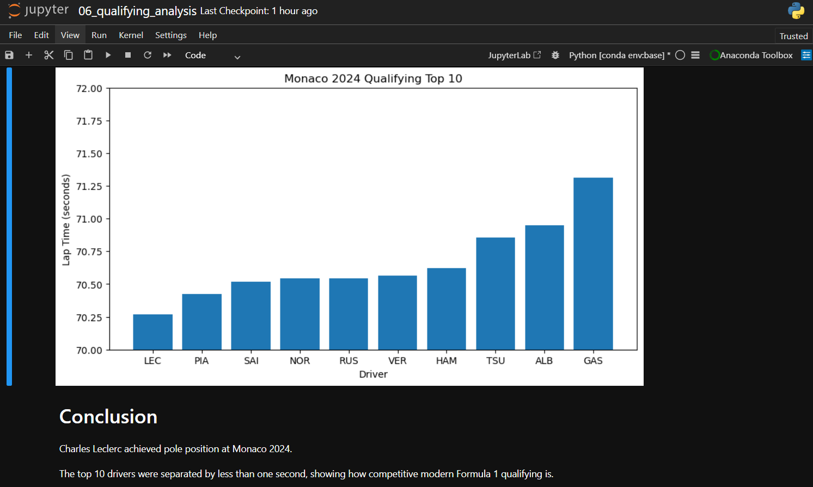
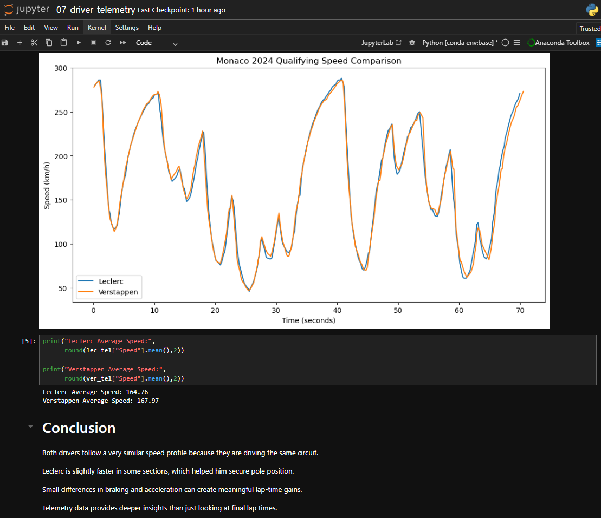
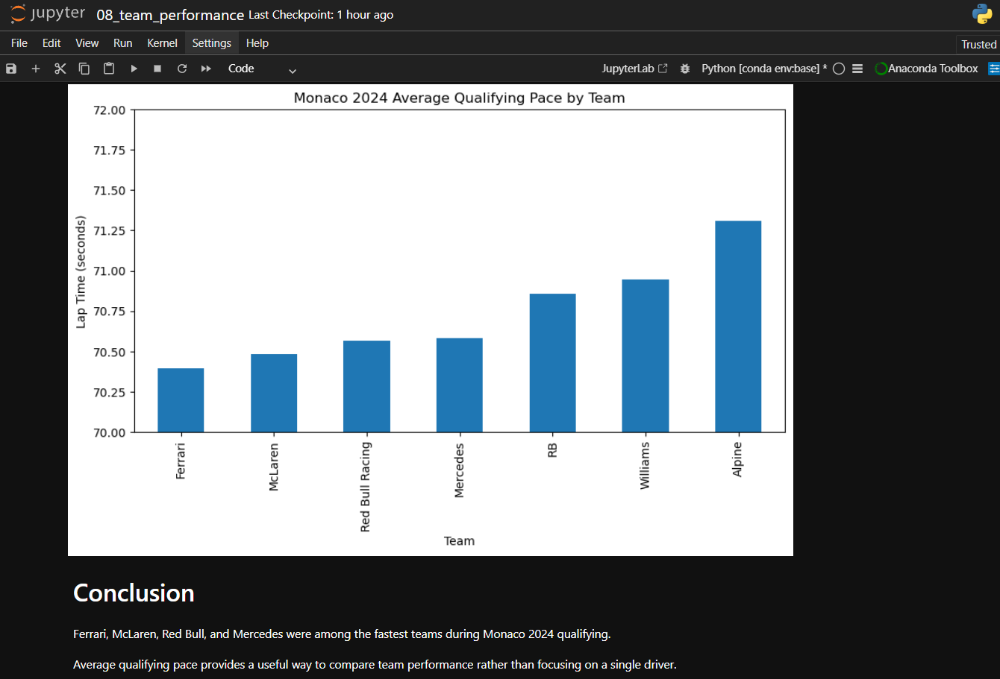
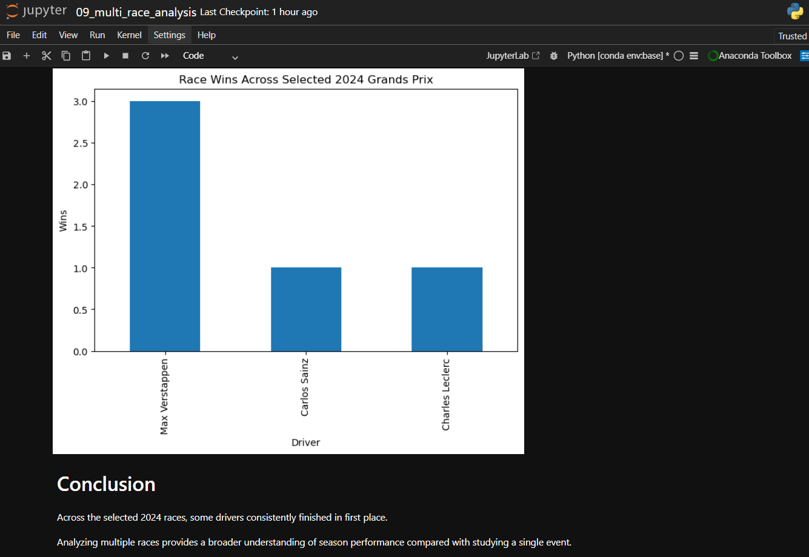

# Formula 1 Data Analysis using Python and FastF1

## Project Overview

This project explores Formula 1 data using Python, Pandas, Matplotlib, and FastF1.

The goal is to analyze historical and modern Formula 1 performance through data visualization and telemetry analysis.

The project combines historical race statistics with real Formula 1 telemetry and session data.

---

## Technologies Used

* Python
* Pandas
* Matplotlib
* FastF1
* Jupyter Notebook

---

## Project Structure

```text
F1_Data_Analysis/
│
├── data/
├── notebook/
├── images/
├── README.md
├── requirements.txt
└── .gitignore
```

---

## Analyses Performed

### Historical F1 Analysis

* Top drivers by wins
* Constructor performance
* Race trends

### FastF1 Analysis

* Monaco 2024 race analysis
* Monaco 2024 qualifying analysis
* Driver telemetry comparison
* Team performance comparison
* Multi-race winner analysis

---

## Sample Visualizations

### Qualifying Analysis



### Driver Telemetry



### Team Performance



### Multi-Race Analysis



---

## How to Run

Install dependencies:

```bash
pip install -r requirements.txt
```

Launch Jupyter:

```bash
jupyter notebook
```

Open notebooks from the notebook folder and run the cells.

---

## Author

Samad Khan

